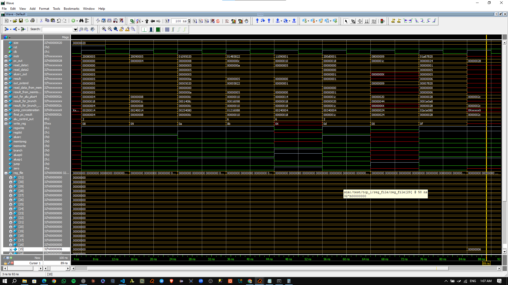

# Single MPIS Processor (Verilog Implementation)

## 📌 Overview

This project presents a **Single MPIS (Message Passing Interface System) Processor** designed and implemented using **Verilog HDL**. The processor simulates message-passing communication within a single-core architecture, allowing parallel computing concepts to be explored in a sequential hardware environment.

The design is verified through simulation using **QuestaSim** and synthesized using **Vivado**, ensuring both functional correctness and hardware feasibility.

---

## 🎯 Objectives

* Demonstrate how message-passing (MPI-like) systems can be implemented in hardware
* Simulate communication between multiple logical processes within a single processor
* Provide a practical learning platform for digital design and parallel computing concepts
* Bridge the gap between software-level parallelism and hardware implementation

---

## 🛠️ Tools & Technologies

* **Verilog HDL** – Hardware description and design
* **QuestaSim** – Functional simulation and waveform analysis
* **Vivado** – Synthesis, implementation, and resource analysis

---

## 🧠 System Architecture

The processor is designed as a **single-core system** that emulates parallel communication through internal modules. The architecture consists of:

* **Control Unit** – Manages instruction flow and coordination
* **Datapath** – Handles data processing operations
* **Message Passing Unit** – Implements send/receive functionality
* **Registers & Memory** – Store intermediate and transmitted data

Although the system runs sequentially, it mimics parallel execution by organizing communication between logical processes.

---

## 🔁 Message Passing Mechanism

The core functionality of this processor is based on message passing:

* `send()` – Transfers data from one logical process to another
* `receive()` – Accepts incoming data and stores it appropriately

This mechanism simulates how processors communicate in distributed systems, but within a single hardware unit.

---

## 🧪 Simulation (QuestaSim)

The design is tested using **QuestaSim** with a dedicated testbench:

* Verification of send/receive operations
* Waveform analysis of signals (clock, reset, data, control signals)
* Functional validation of processor behavior

The simulation confirms correct communication and timing behavior.

---

## ⚙️ Synthesis (Vivado)

The design is synthesized using **Vivado**, where:

* RTL design is generated and analyzed
* Resource utilization (LUTs, Flip-Flops) is evaluated
* Timing constraints are checked
* RTL schematic is inspected

This ensures the design is implementable on real hardware (FPGA).

---

## 📸 Results

### 🧪 Simulation Output

Simulation waveforms demonstrate correct data transfer and synchronization between logical processes using message passing.

### ⚙️ Synthesis Output

Vivado reports confirm successful synthesis with acceptable resource utilization and a clear RTL structure.

---

## 📖 Use Cases

* Educational projects in digital design and computer architecture
* Understanding MPI concepts at hardware level
* Simulation of parallel communication in constrained environments
* FPGA-based academic research

---

## 🚀 Future Improvements

* Extend design to multi-core architecture
* Add non-blocking communication support
* Improve performance and timing efficiency
* Implement real FPGA deployment

---

## 👨‍💻 Author
Amr Soliman 
[[LinkedIn Profile](https://www.linkedin.com/in/amr-soliman19/)]
